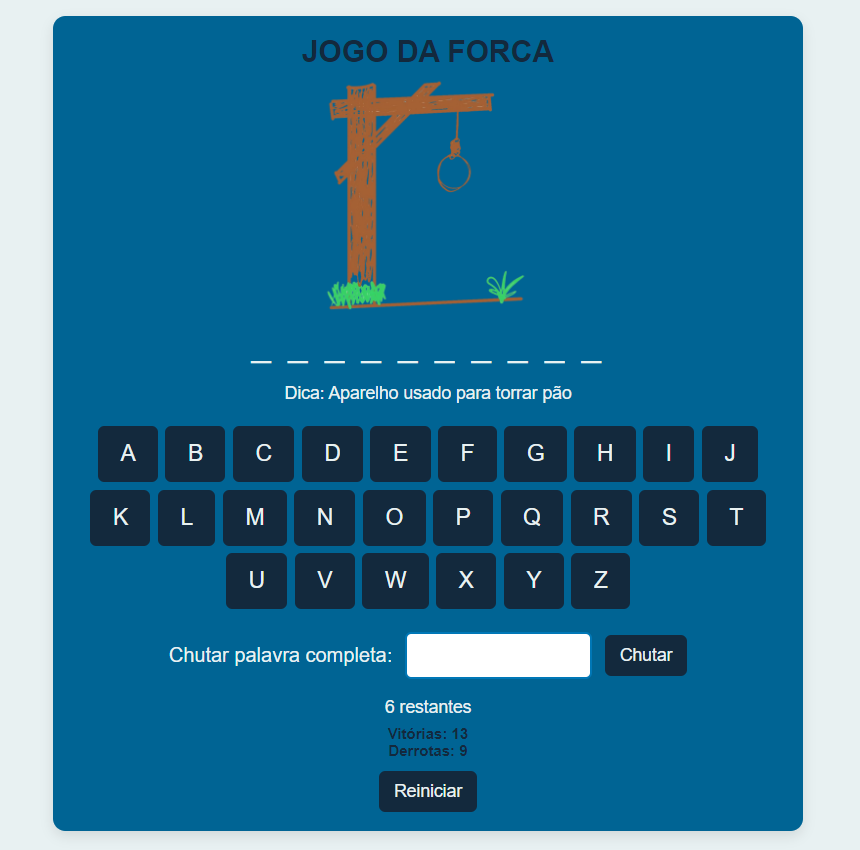
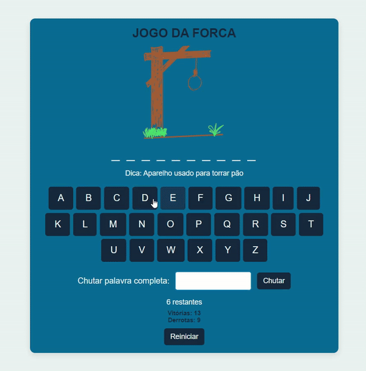

# Jogo da Forca

Este é um jogo da forca online desenvolvido com **JavaScript Vanilla, Typescript** e **Vite**, que inclui funcionalidades como chutar a palavra de uma vez, dicas, e um teclado virtual. O jogo também permite salvar o progresso localmente, com registro de vitórias e derrotas.

## Sumário

- [Pré-requisitos](#pré-requisitos)
- [Instalação](#instalação)
- [Rodando o projeto](#rodando-o-projeto)
- [Funcionalidades](#funcionalidades)
- [Como Jogar](#como-jogar)
- [Tecnologias Utilizadas](#tecnologias-utilizadas)

## Pré-requisitos

Antes de começar, você precisará ter instalado:

- [Node.js](https://nodejs.org/) (recomendado v16+)
- [Git](https://git-scm.com/)
- Gerenciador de pacotes `npm` (instalado com o Node.js)
  
## Instalação

### 1. Clone o repositório

Use o comando abaixo para clonar o repositório em sua máquina local:

```bash
git clone https://github.com/lettribeiros/jogo-da-forca.git
```

### 2. Instale as dependências

Acesse o diretório do projeto clonado e instale as dependências necessárias:

```bash
cd jogo-da-forca
npm install
```

### 3. Inicie a API simulada (Json Server)

Este projeto utiliza o **Json Server** para fornecer palavras aleatórias para o jogo. Use o seguinte comando para iniciar a API:

```bash
npx json-server --watch db.json --port 3000
```

A API será executada em `http://localhost:3000` e fornecerá as palavras e dicas necessárias para o jogo.

### 4. Execute o projeto com Vite

Agora que a API está em execução, você pode iniciar o projeto Vite:

```bash
npm run dev
```

Isso abrirá o projeto no navegador. Se não abrir automaticamente, acesse `http://localhost:5173`.

## Funcionalidades

- **Teclado Virtual**: Permite ao jogador clicar nas letras para adivinhar a palavra.
- **Chutar Palavra**: O jogador pode tentar adivinhar a palavra inteira.
- **Dicas**: A cada palavra aleatória, uma dica é exibida.
- **Registro de Vitórias e Derrotas**: O jogo salva o número de vitórias e derrotas no local storage do navegador.
- **Reiniciar Jogo**: Após vencer ou perder, o jogador pode reiniciar a partida.
- **Imagens de Progresso**: As imagens da forca mudam a cada erro, mostrando o progresso visual.

## Como Jogar

1. O jogo escolhe uma palavra aleatória de uma lista.
2. Uma dica relacionada à palavra é exibida para ajudar o jogador.
3. Use o **teclado virtual** na tela para adivinhar as letras. Cada letra correta será revelada, enquanto cada erro reduzirá suas tentativas.
4. Se preferir, você pode tentar **chutar a palavra completa** usando o campo de texto e o botão "Chutar".
5. O jogador vence se adivinhar todas as letras ou acertar a palavra completa. Caso contrário, perderá quando as tentativas acabarem.
6. Ao vencer ou perder, o número de vitórias ou derrotas será atualizado no placar.

## Tecnologias Utilizadas

- **Vite**: Ferramenta para desenvolvimento rápido de aplicações web.
- **JavaScript Vanilla**: Linguagem principal do projeto.
- **TypeScript**: Utilizado para garantir tipagem estática e organização do código.
- **CSS3**: Para estilização da interface.
- **Json Server**: Simula uma API para fornecer palavras e dicas aleatórias.

## Exemplo de Jogo

## Demonstração do Jogo

## Demonstração do Jogo




## Contribuindo

Fique à vontade para contribuir com melhorias, abrir issues ou fazer pull requests.

---

Divirta-se jogando e boa sorte!

---
### Desenvolvido por Letícia Ribeiro


#### Entre em contato comigo - [Linkedin](https://www.linkedin.com/in/leticia-ribeiro-dev-eng/)
